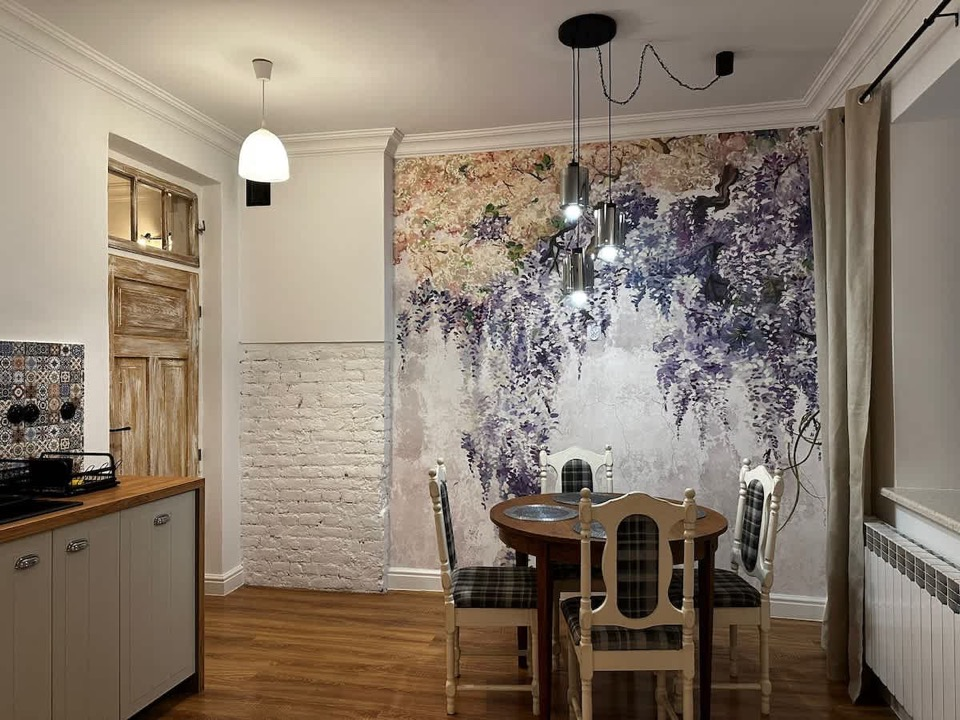
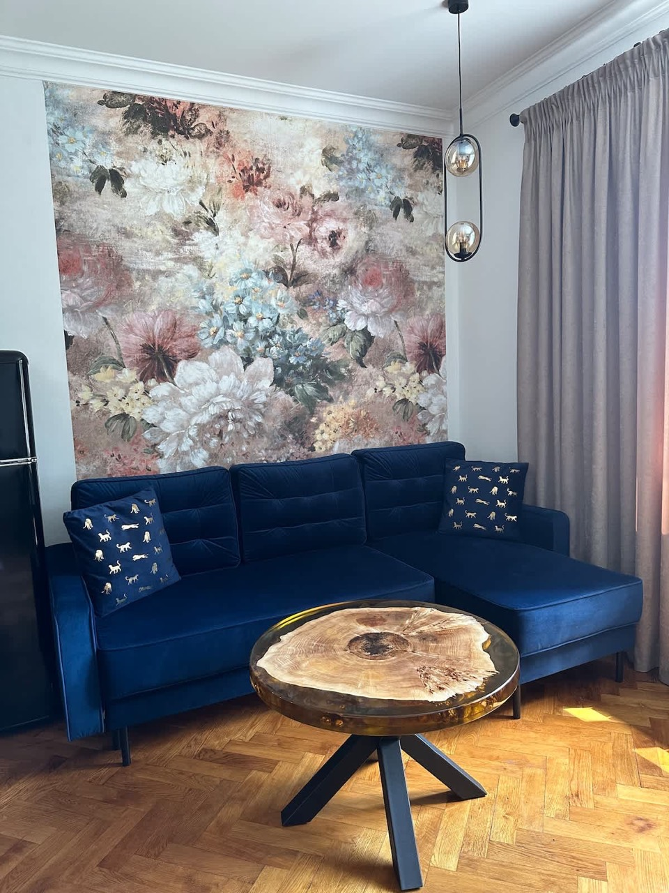

<!-- HERO -->
::: {.hero-section .hero--home}
::: {.hero-content}

[APARTAMENTY]{.hero-logo-text}

[ORLICZ 32]{.hero-title}

::: {.hero-divider}
[]{.line}
[]{.diamond}
[]{.line}
:::

["Feel like home while you are away"]{.hero-tagline}

[UNESCO World Heritage City • Zamość, Poland]{.hero-subtitle}

::: {.hero-cta}
[Book Your Stay](book.qmd){.btn-book}
:::

:::

::: {.scroll-indicator}
::: {.mouse}
:::
:::

:::

<!-- ABOUT + HOST -->
::: {.section .section-light}
::: {.container}
::: {.section-header}
[Our Place]{.section-subtitle}

## Welcome to Orlicz 32

::: {.divider-arch}
:::
:::

::: {.about-content}
Orlicz-Dreszera is a quiet villa street on the edge of the old fortifications. Our house stands at number 32, and two of its apartments are let to guests — 55 m² and 50 m². We renovated both ourselves and we still live close enough to hand over the keys in person.

The walk to Rynek Wielki takes about fifteen minutes, most of it along residential streets. What UNESCO listed in 1992 is not a single building but the plan itself: a whole town set out in 1580 to one Renaissance design by Bernardo Morando, and still standing largely as he drew it.

Inside, we let the rooms keep the character they came with — herringbone parquet, a floral mural above the dining table, a navy velvet sofa, a distressed old door we refused to throw out. The rest is the ordinary equipment that makes a week away work: proper beds, a full kitchen with a dishwasher, a washing machine, fibre WiFi, and free parking in the yard.
:::

::: {.host-block}
::: {.host-monogram}
RK
:::
::: {.host-text}
### Your host — Robert

I look after both apartments myself. We live a few minutes away, so if a plan changes or a train runs late, send me a message on WhatsApp — I normally reply within a couple of hours.

I am glad to fix a check-in time that suits your journey, and to point you at the restaurants we actually eat in rather than the ones on the square with the biggest sign. English and Polish are both fine.
:::
:::
:::
:::

<!-- WHAT YOU GET -->
::: {.section .section-white}
::: {.container}
::: {.section-header}
[What You Get]{.section-subtitle}

## What you can count on
:::

::: {.features-grid}

::: {.feature-card}
::: {.feature-icon}

:::
### A real home base
A full kitchen with a dishwasher, a washing machine, and room for five people to spread out. Stay a week without eating in a restaurant every night.
:::

::: {.feature-card}
::: {.feature-icon}

:::
### The Renaissance at a walk
Zamość was laid out in 1580 as one planned town and UNESCO listed it in 1992. Rynek Wielki is fifteen minutes on foot from our gate.
:::

::: {.feature-card}
::: {.feature-icon}

:::
### A host who answers
You have a direct WhatsApp line to Robert, not a call centre queue. Arrivals move when your travel does — just tell us when.
:::

:::
:::
:::

<!-- APARTMENTS PREVIEW -->
::: {.section .section-light}
::: {.container}
::: {.section-header}
[Accommodation]{.section-subtitle}

## Two apartments
:::

::: {.row}
::: {.col-md-6}
::: {.apartment-card}
::: {.apartment-image}
{fig-alt="Dining corner with wisteria mural and herringbone parquet — Room Nr 1" srcset="images/opt/room1-main-480.webp 480w, images/opt/room1-main-960.webp 960w" sizes="(max-width: 768px) 100vw, 50vw" width="960" height="720" loading="lazy" decoding="async"}
:::
::: {.apartment-details}
### Room Nr 1
::: {.apartment-features}
[ Sleeps 5]{} [ 55m²]{} [ Walk-in shower]{}
:::
55 m² on one floor, with a double bed in the bedroom and a double plus a single sofa bed in the living room. Families take this one — there is floor space for a cot and a table everyone fits around.

[Details →](apartments.qmd){.btn-details}
[Photos →](gallery.qmd#room-nr-1){.btn-details}
[Book →](book-room1.qmd){.btn-details}
:::
:::
:::

::: {.col-md-6}
::: {.apartment-card}
::: {.apartment-image}
{fig-alt="Bright living room with navy velvet sofa — Room Nr 3" srcset="images/opt/room3-main-480.webp 480w, images/opt/room3-main-960.webp 960w" sizes="(max-width: 768px) 100vw, 50vw" width="960" height="1280" loading="lazy" decoding="async"}
:::
::: {.apartment-details}
### Room Nr 3
::: {.apartment-features}
[ Sleeps 3]{} [ 50m²]{} [ Bathtub]{}
:::
50 m² with a queen bed, a single bed and windows large enough that the lights stay off until evening. It has a bathtub as well as a shower, which is usually why couples pick it.

[Details →](apartments.qmd){.btn-details}
[Photos →](gallery.qmd#room-nr-3){.btn-details}
[Book →](book-room3.qmd){.btn-details}
:::
:::
:::
:::

::: {.section-cta}
[See both apartments](apartments.qmd){.btn-gold}
:::

:::
:::

<!-- BOOK DIRECT -->
::: {#booking .section .booking-section}
::: {.container}
::: {.section-header}
[Reservations]{.section-subtitle}

## Book Direct
:::

::: {.why-direct}

::: {.why-item}


### Best rate, always
Our lowest rate is the one on this site. No platform commission is added on top of it.
:::

::: {.why-item}


### One message away
You write to Robert and Robert writes back. WhatsApp +48 508 209 313, or info@orlicz32.pl.
:::

::: {.why-item}


### Flexible arrivals
Check-in runs 16:00 to 21:00, and we move it by arrangement when your travel says otherwise.
:::

:::

::: {.section-cta}
[Check availability](book.qmd){.btn-book-large}
:::

:::
:::

<!-- REVIEWS -->
::: {.section .section-light .testimonials-section}
::: {.container}
::: {.section-header}
[Guests]{.section-subtitle}

## What Guests Say

::: {.rating-badge}
 **4.8** — 148 reviews across Booking.com, Airbnb & Google
:::
:::

::: {.review-excerpts}

::: {.review-excerpt-card}
> "The apartment deserves the highest rating. Contact with the owner — 5 stars. Clean, beautiful, tastefully decorated. Kitchen equipped brilliantly. Everything you need and even more."

[— Ewa Grabowska, Google]{.review-source}
:::

::: {.review-excerpt-card}
> "Apartment finished with attention to every detail, atmospheric, with soul. Impeccable cleanliness, snowy white bedding and towels."

[— Marian, Booking.com]{.review-source}
:::

::: {.review-excerpt-card}
> "Very clean apartment that matched the description, well-equipped kitchen, close proximity to the Old Town, very quiet neighbourhood. The host is very communicative and friendly."

[— Grzegorz, Airbnb]{.review-source}
:::

::: {.review-excerpt-card}
> "I'm a regular guest and always return. Staff is courteous and helpful. This place has everything I need: free WiFi, parking, kitchen equipment, flat-screen TV."

[— Kazimierz, Booking.com]{.review-source}
:::

:::

::: {.reviews-live-rule}
More reviews, live from Booking & Google
:::

::: {.testimonial-widget-container}

<!-- Elfsight All-in-One Reviews Widget -->

:::
:::
:::

<!-- LOCATION -->
::: {.section .section-white}
::: {.container}
::: {.section-header}
[Location]{.section-subtitle}

## A quiet street, ten minutes out
:::

::: {.row}
::: {.col-lg-8}
::: {.map-frame}
<iframe src="https://www.google.com/maps?q=50.717276,23.263793&hl=en&z=16&output=embed" title="Map — Apartamenty Orlicz 32, Orlicz-Dreszera 32, Zamość" width="100%" height="400" allowfullscreen loading="lazy"></iframe>

::: {.map-caption}
 Orlicz-Dreszera 32, 22-400 Zamość · 15 min on foot to Rynek Wielki
:::
:::
:::

::: {.col-lg-4}
::: {.location-info}
### Contact & Info

::: {.info-item}
::: {.info-icon}

:::
::: {.info-text}
#### Address
Orlicz-Dreszera 32, 22-400 Zamość, Poland
:::
:::

::: {.info-item}
::: {.info-icon}

:::
::: {.info-text}
#### Check-in
16:00 – 21:00, flexible by arrangement
:::
:::

::: {.info-item}
::: {.info-icon}

:::
::: {.info-text}
#### Check-out
Before 11:00
:::
:::

::: {.info-item}
::: {.info-icon}

:::
::: {.info-text}
#### Phone & WhatsApp
[+48 508 209 313](tel:+48508209313)
:::
:::

:::
:::
:::
:::
:::

<!-- ZAMOŚĆ TEASER -->
::: {.section .section-dark}
::: {.container}
::: {.section-header}
[The City]{.section-subtitle}

## Pearl of the Renaissance
:::

::: {.about-content}
Jan Zamoyski founded Zamość in 1580 and gave Bernardo Morando, an architect from Padua, a single commission: draw the whole town at once. Streets, market squares, the town hall and the fortifications all belong to one plan, which is why UNESCO added Zamość to the World Heritage list in 1992.

Rynek Wielki still works as a square rather than a museum piece — a market in the morning, cafés under the arcades, and the merchant house façades lit after dark. From our door it is a fifteen-minute walk each way.

::: {.section-cta}
[Explore Zamość](zamosc.qmd){.btn-outline-gold}
:::
:::
:::
:::
