::: {.hero-section .hero--secondary .hero--gallery}
::: {.hero-content}

[Galeria]{.hero-logo-text}

[Rozejrzyj się]{.hero-title}

::: {.hero-divider}
[]{.line}
[]{.diamond}
[]{.line}
:::

:::
:::

<!-- GALERIA APARTAMENTU NR 1 -->
::: {.section .section-light}
::: {.container}
::: {.section-header}
[Apartament]{.section-subtitle}

## Apartament Nr 1 {#room-nr-1}

[55m² · 5 osób · prysznic walk-in]{.spec-line}
:::

::: {.gallery-grid}

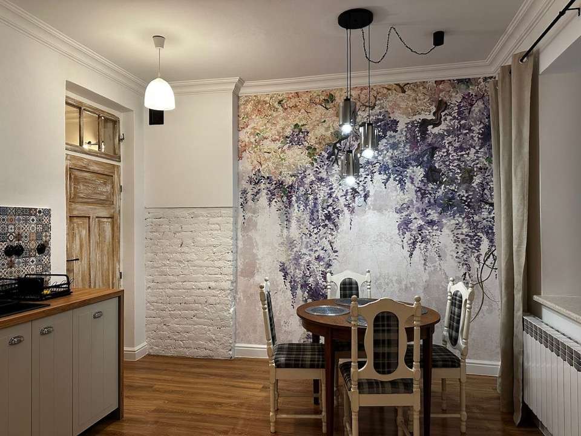{group="room1" fig-alt="Salon z rozkładaną sofą — Apartament Nr 1" srcset="../images/opt/room1/01-480.webp 480w, ../images/opt/room1/01-960.webp 960w" sizes="(max-width: 768px) 50vw, 33vw" width="960" height="720" loading="eager" decoding="async"}

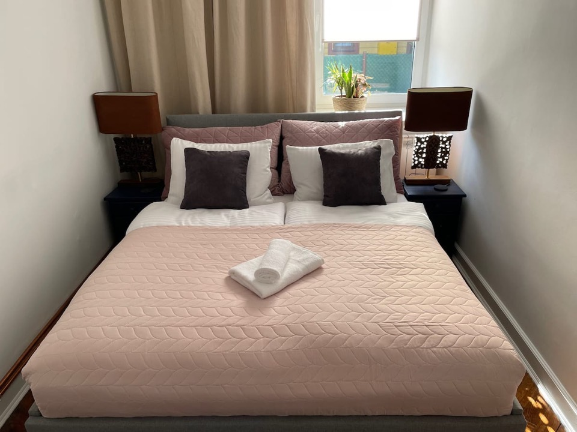{group="room1" fig-alt="Łóżko podwójne — Apartament Nr 1" srcset="../images/opt/room1/02-480.webp 480w, ../images/opt/room1/02-960.webp 960w" sizes="(max-width: 768px) 50vw, 33vw" width="960" height="720" loading="lazy" decoding="async"}

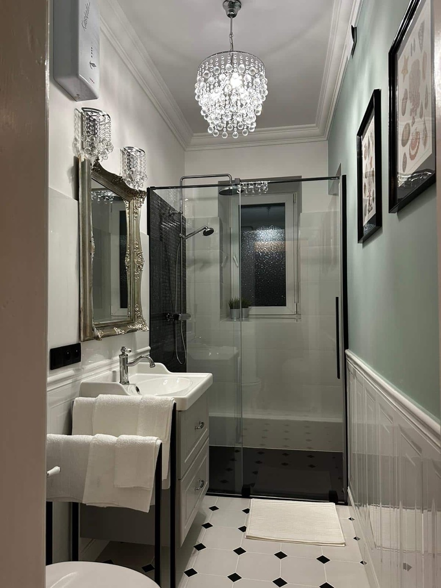{group="room1" fig-alt="Kuchnia — Apartament Nr 1" srcset="../images/opt/room1/03-480.webp 480w, ../images/opt/room1/03-960.webp 960w" sizes="(max-width: 768px) 50vw, 33vw" width="960" height="1280" loading="lazy" decoding="async"}

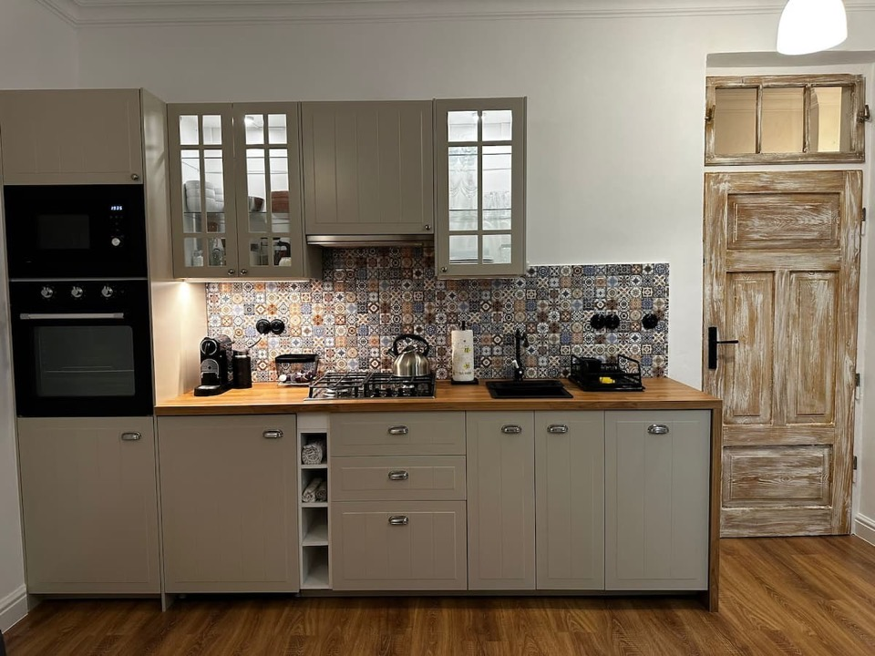{group="room1" fig-alt="Stół jadalny — Apartament Nr 1" srcset="../images/opt/room1/04-480.webp 480w, ../images/opt/room1/04-960.webp 960w" sizes="(max-width: 768px) 50vw, 33vw" width="960" height="720" loading="lazy" decoding="async"}

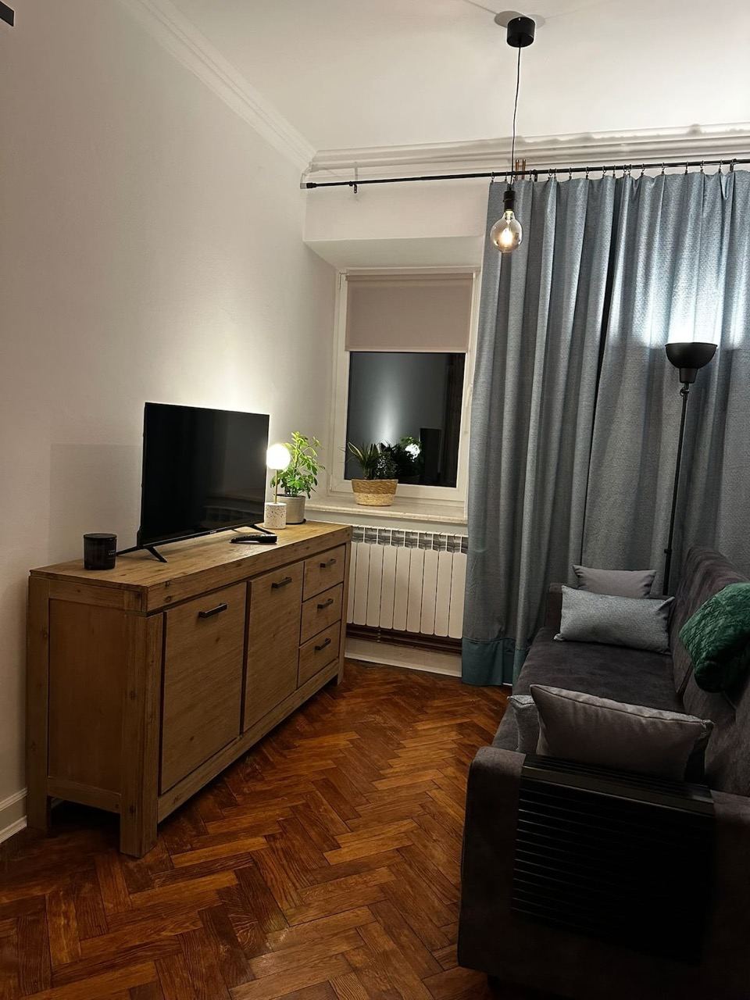{group="room1" fig-alt="Biurko i część wypoczynkowa — Apartament Nr 1" srcset="../images/opt/room1/05-480.webp 480w, ../images/opt/room1/05-960.webp 960w" sizes="(max-width: 768px) 50vw, 33vw" width="960" height="1280" loading="lazy" decoding="async"}

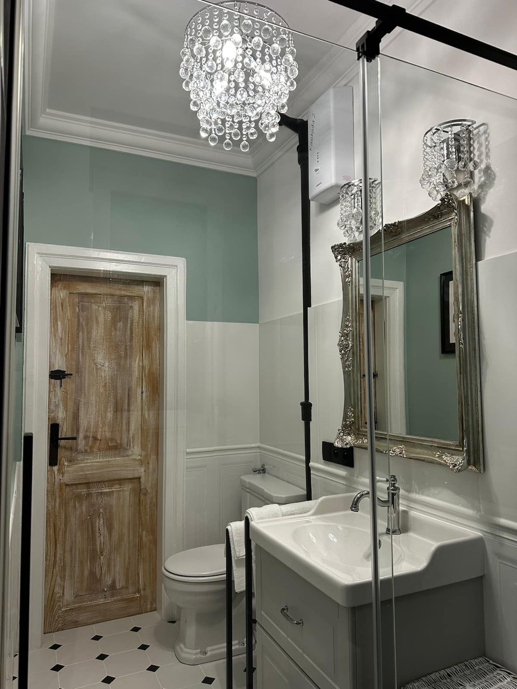{group="room1" fig-alt="Łazienka z prysznicem walk-in — Apartament Nr 1" srcset="../images/opt/room1/06-480.webp 480w, ../images/opt/room1/06-960.webp 960w" sizes="(max-width: 768px) 50vw, 33vw" width="960" height="1280" loading="lazy" decoding="async"}

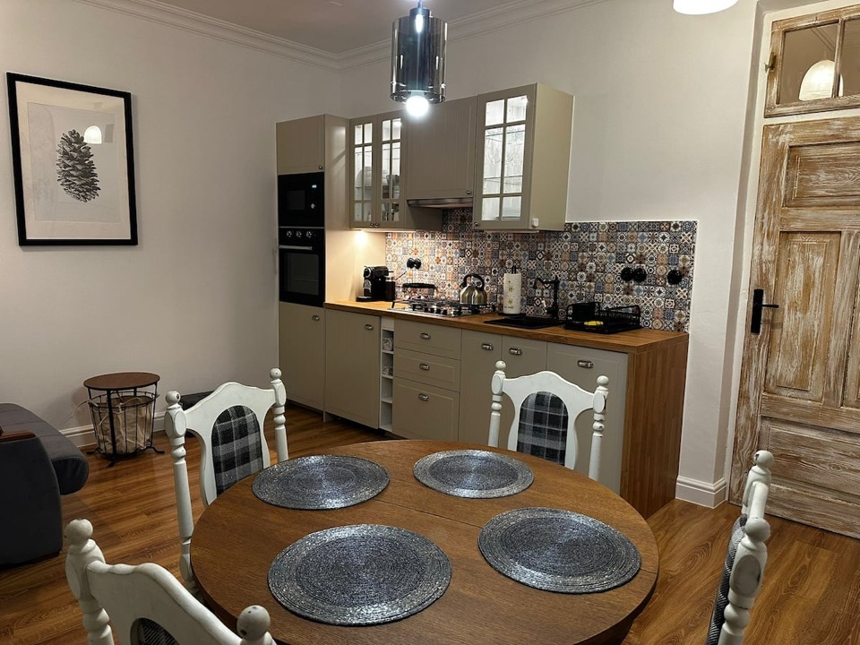{group="room1" fig-alt="Detal wnętrza — Apartament Nr 1" srcset="../images/opt/room1/07-480.webp 480w, ../images/opt/room1/07-960.webp 960w" sizes="(max-width: 768px) 50vw, 33vw" width="960" height="720" loading="lazy" decoding="async"}

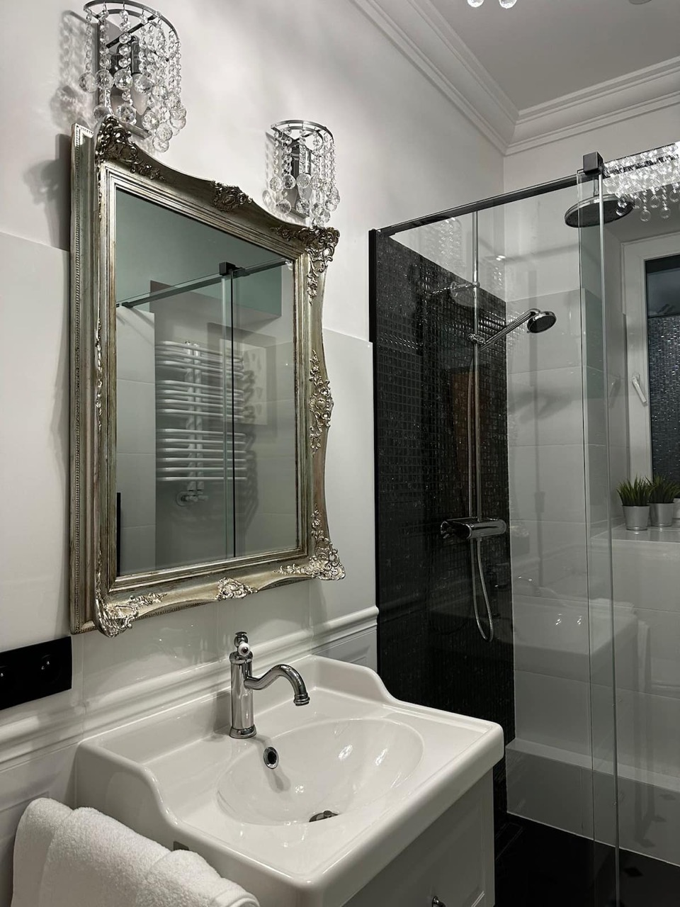{group="room1" fig-alt="Sprzęty kuchenne i szafki — Apartament Nr 1" srcset="../images/opt/room1/08-480.webp 480w, ../images/opt/room1/08-960.webp 960w" sizes="(max-width: 768px) 50vw, 33vw" width="960" height="1280" loading="lazy" decoding="async"}

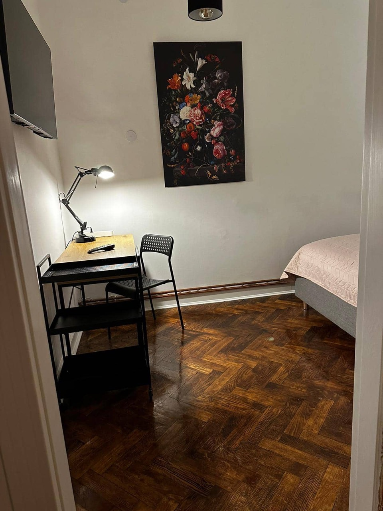{group="room1" fig-alt="Okno i światło dzienne — Apartament Nr 1" srcset="../images/opt/room1/09-480.webp 480w, ../images/opt/room1/09-960.webp 960w" sizes="(max-width: 768px) 50vw, 33vw" width="960" height="1280" loading="lazy" decoding="async"}

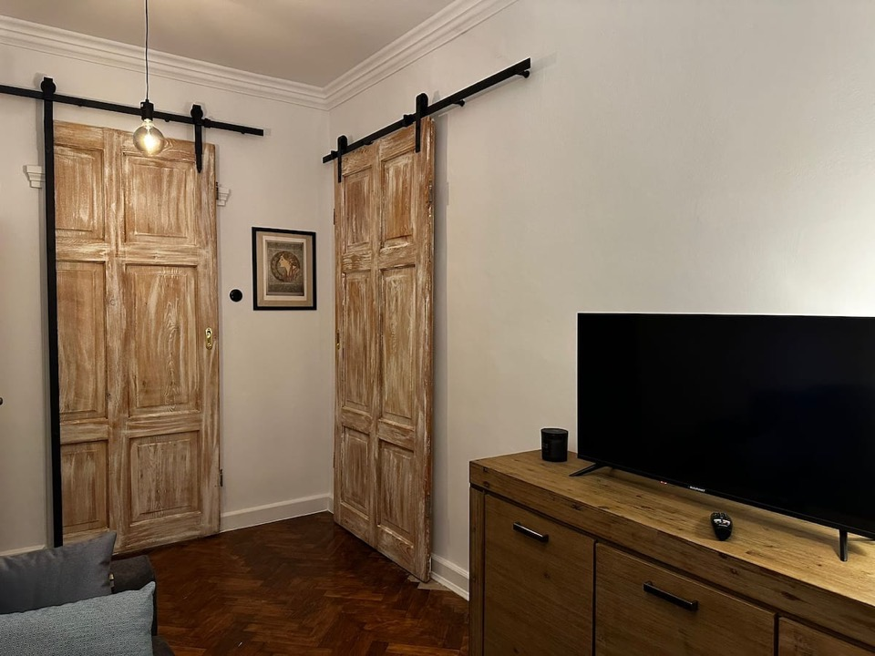{group="room1" fig-alt="Rozłożona sofa — Apartament Nr 1" srcset="../images/opt/room1/10-480.webp 480w, ../images/opt/room1/10-960.webp 960w" sizes="(max-width: 768px) 50vw, 33vw" width="960" height="720" loading="lazy" decoding="async"}

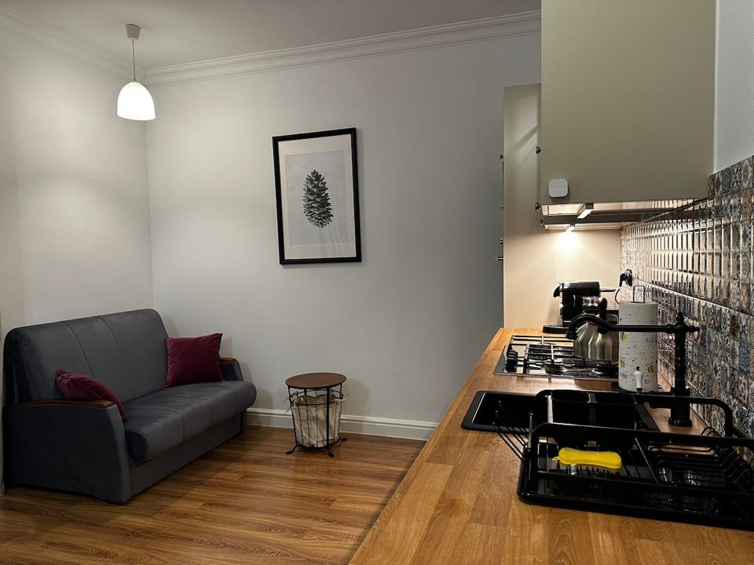{group="room1" fig-alt="Szafa i miejsce na rzeczy — Apartament Nr 1" srcset="../images/opt/room1/11-480.webp 480w, ../images/opt/room1/11-960.webp 960w" sizes="(max-width: 768px) 50vw, 33vw" width="960" height="720" loading="lazy" decoding="async"}

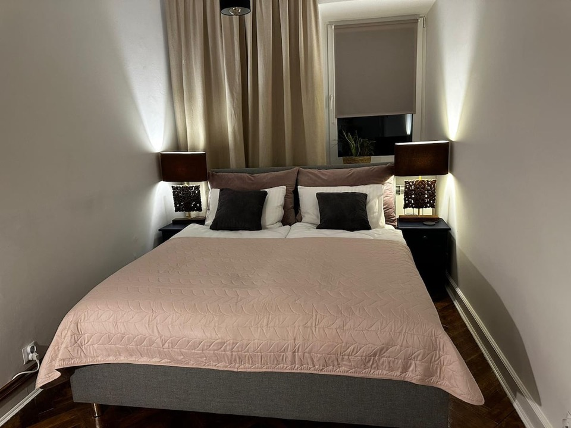{group="room1" fig-alt="Smart TV i część wypoczynkowa — Apartament Nr 1" srcset="../images/opt/room1/12-480.webp 480w, ../images/opt/room1/12-960.webp 960w" sizes="(max-width: 768px) 50vw, 33vw" width="960" height="720" loading="lazy" decoding="async"}

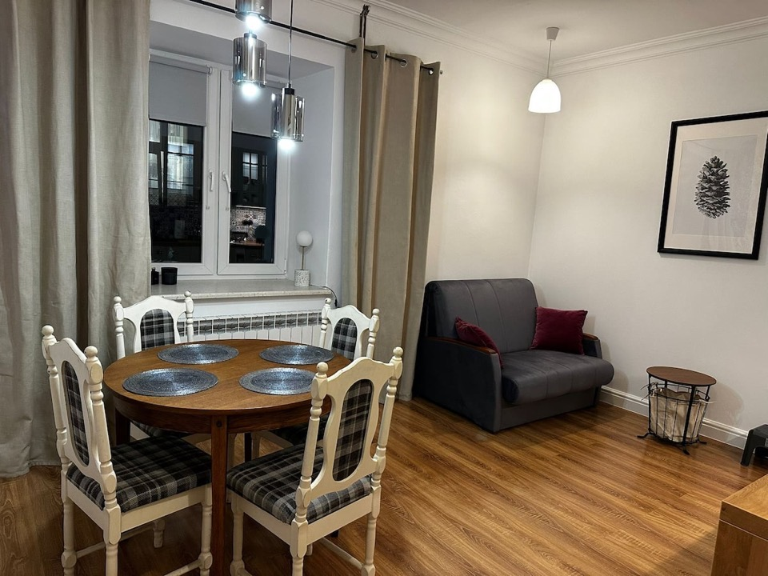{group="room1" fig-alt="Przedpokój — Apartament Nr 1" srcset="../images/opt/room1/13-480.webp 480w, ../images/opt/room1/13-960.webp 960w" sizes="(max-width: 768px) 50vw, 33vw" width="960" height="720" loading="lazy" decoding="async"}

:::

::: {.section-cta}
[Zarezerwuj Apartament Nr 1](book-room1.qmd){.btn-gold}
:::

:::
:::

<!-- GALERIA APARTAMENTU NR 3 -->
::: {.section .section-white}
::: {.container}
::: {.section-header}
[Apartament]{.section-subtitle}

## Apartament Nr 3 {#room-nr-3}

[50m² · 3 osoby · wanna z prysznicem]{.spec-line}
:::

::: {.gallery-grid}

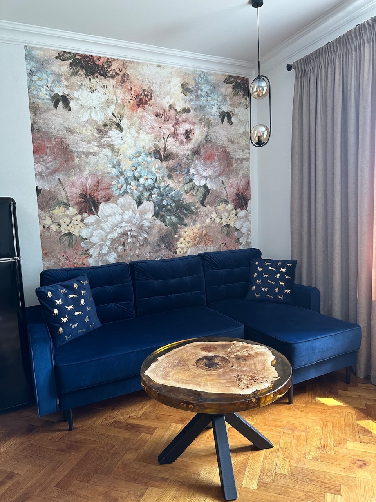{group="room3" fig-alt="Część dzienna — Apartament Nr 3" srcset="../images/opt/room3/01-living-480.webp 480w, ../images/opt/room3/01-living-960.webp 960w" sizes="(max-width: 768px) 50vw, 33vw" width="960" height="1280" loading="eager" decoding="async"}

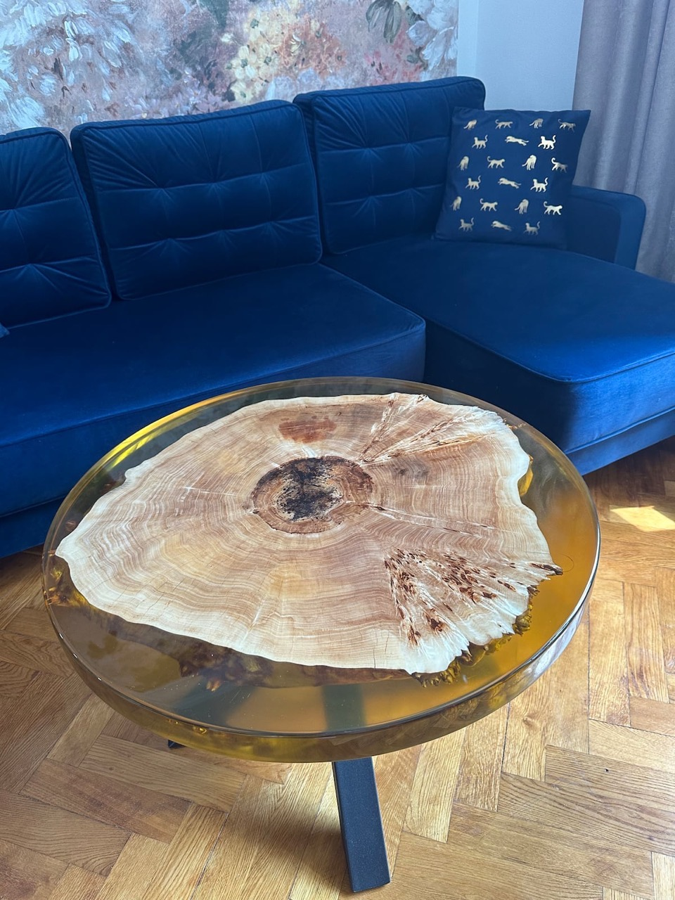{group="room3" fig-alt="Sypialnia z łóżkiem queen — Apartament Nr 3" srcset="../images/opt/room3/02-bedroom-480.webp 480w, ../images/opt/room3/02-bedroom-960.webp 960w" sizes="(max-width: 768px) 50vw, 33vw" width="960" height="1280" loading="lazy" decoding="async"}

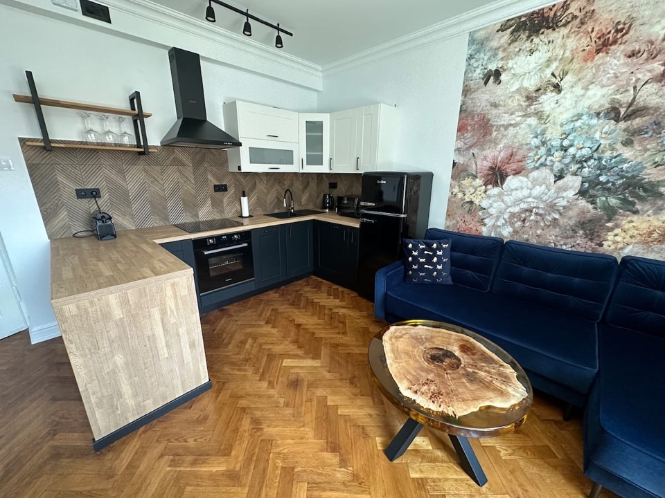{group="room3" fig-alt="Kuchnia — Apartament Nr 3" srcset="../images/opt/room3/03-kitchen-480.webp 480w, ../images/opt/room3/03-kitchen-960.webp 960w" sizes="(max-width: 768px) 50vw, 33vw" width="960" height="720" loading="lazy" decoding="async"}

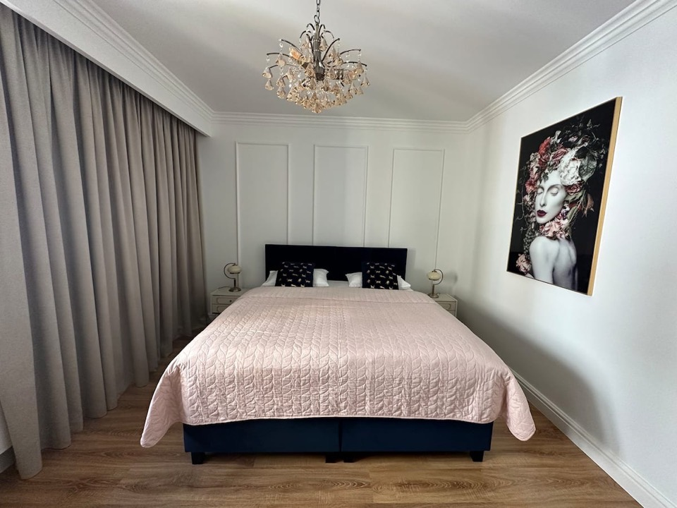{group="room3" fig-alt="Detal wnętrza — Apartament Nr 3" srcset="../images/opt/room3/04-detail-480.webp 480w, ../images/opt/room3/04-detail-960.webp 960w" sizes="(max-width: 768px) 50vw, 33vw" width="960" height="720" loading="lazy" decoding="async"}

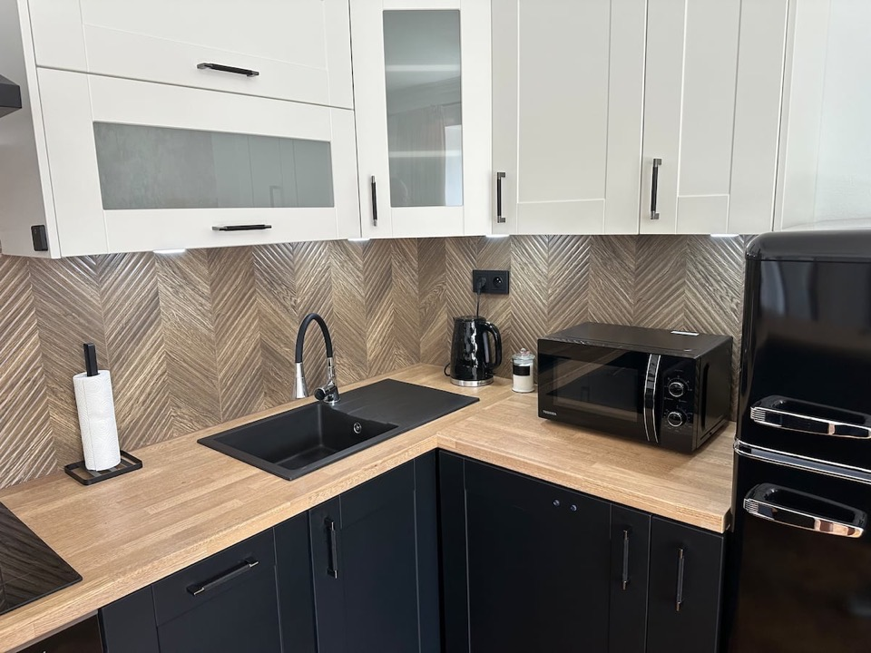{group="room3" fig-alt="Widok z okna — Apartament Nr 3" srcset="../images/opt/room3/05-view-480.webp 480w, ../images/opt/room3/05-view-960.webp 960w" sizes="(max-width: 768px) 50vw, 33vw" width="960" height="720" loading="lazy" decoding="async"}

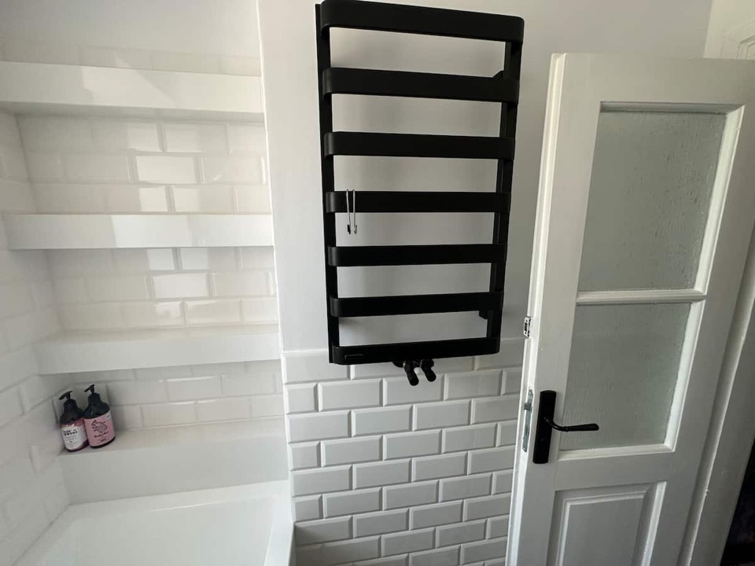{group="room3" fig-alt="Łóżko pojedyncze i część wypoczynkowa — Apartament Nr 3" srcset="../images/opt/room3/06-room-480.webp 480w, ../images/opt/room3/06-room-960.webp 960w" sizes="(max-width: 768px) 50vw, 33vw" width="960" height="720" loading="lazy" decoding="async"}

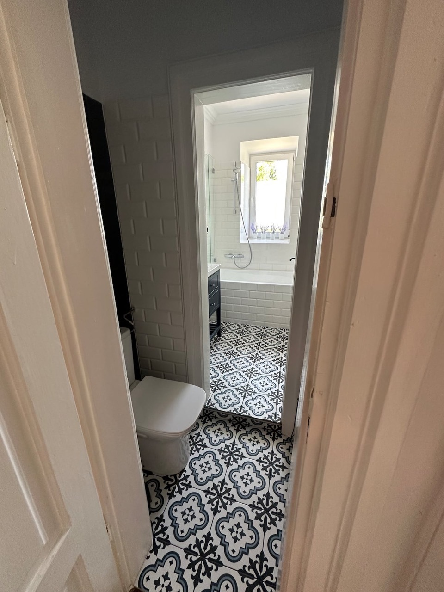{group="room3" fig-alt="Łazienka z wanną i prysznicem — Apartament Nr 3" srcset="../images/opt/room3/07-bathroom-480.webp 480w, ../images/opt/room3/07-bathroom-960.webp 960w" sizes="(max-width: 768px) 50vw, 33vw" width="960" height="1280" loading="lazy" decoding="async"}

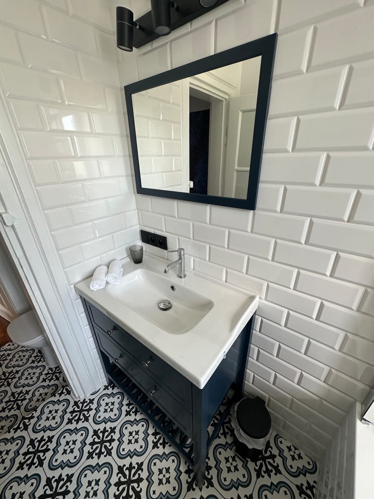{group="room3" fig-alt="Wnętrze i umeblowanie — Apartament Nr 3" srcset="../images/opt/room3/08-interior-480.webp 480w, ../images/opt/room3/08-interior-960.webp 960w" sizes="(max-width: 768px) 50vw, 33vw" width="960" height="1280" loading="lazy" decoding="async"}

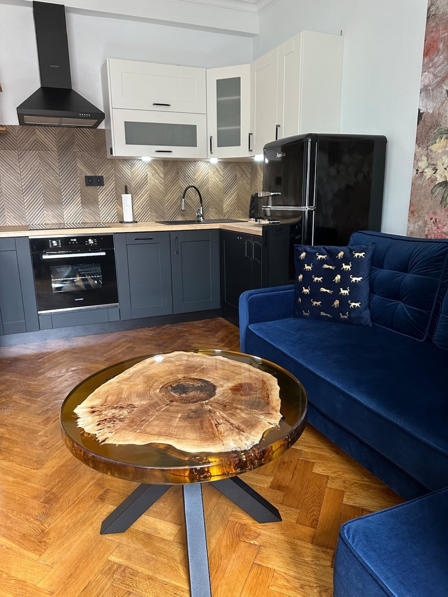{group="room3" fig-alt="Otwarty układ wnętrza — Apartament Nr 3" srcset="../images/opt/room3/09-space-480.webp 480w, ../images/opt/room3/09-space-960.webp 960w" sizes="(max-width: 768px) 50vw, 33vw" width="960" height="1280" loading="lazy" decoding="async"}

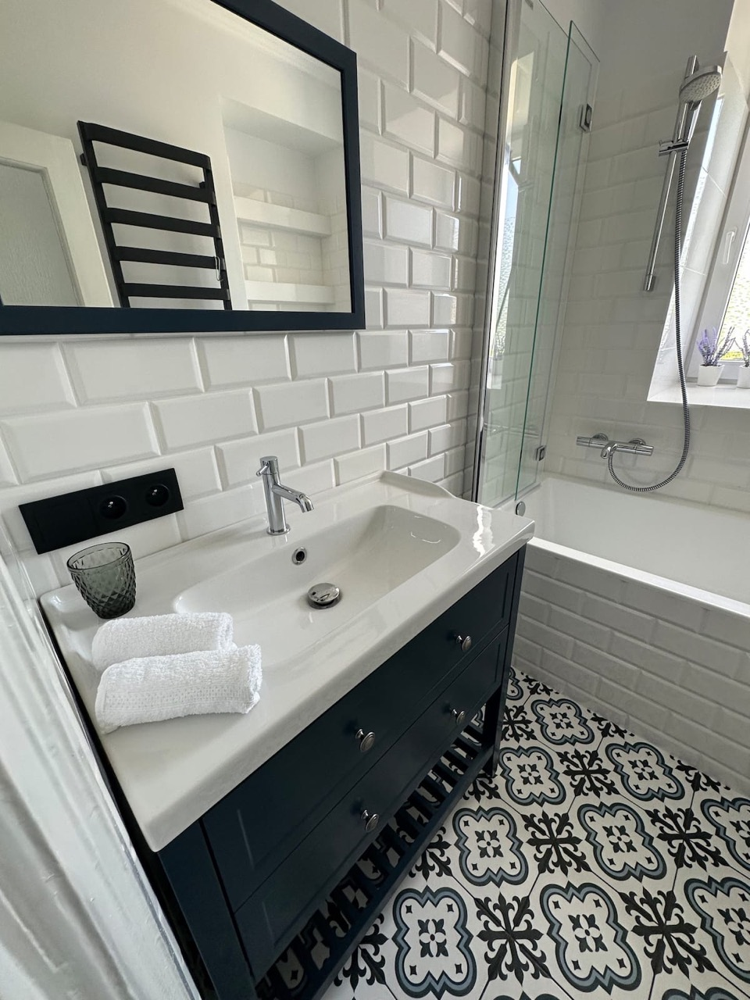{group="room3" fig-alt="Ręczniki i kosmetyki — Apartament Nr 3" srcset="../images/opt/room3/10-amenity-480.webp 480w, ../images/opt/room3/10-amenity-960.webp 960w" sizes="(max-width: 768px) 50vw, 33vw" width="960" height="1280" loading="lazy" decoding="async"}

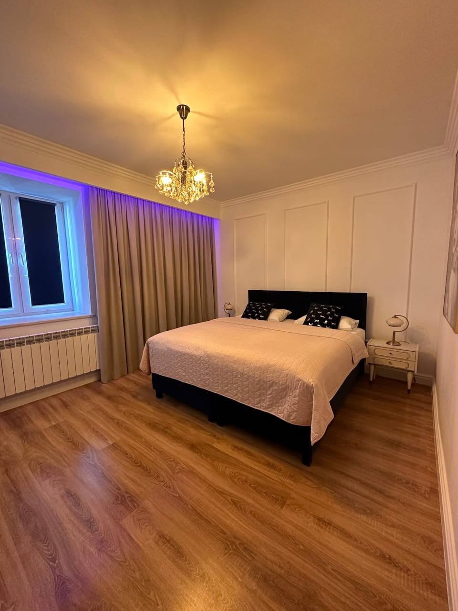{group="room3" fig-alt="Miejsce do jedzenia i pracy — Apartament Nr 3" srcset="../images/opt/room3/11-area-480.webp 480w, ../images/opt/room3/11-area-960.webp 960w" sizes="(max-width: 768px) 50vw, 33vw" width="960" height="1280" loading="lazy" decoding="async"}

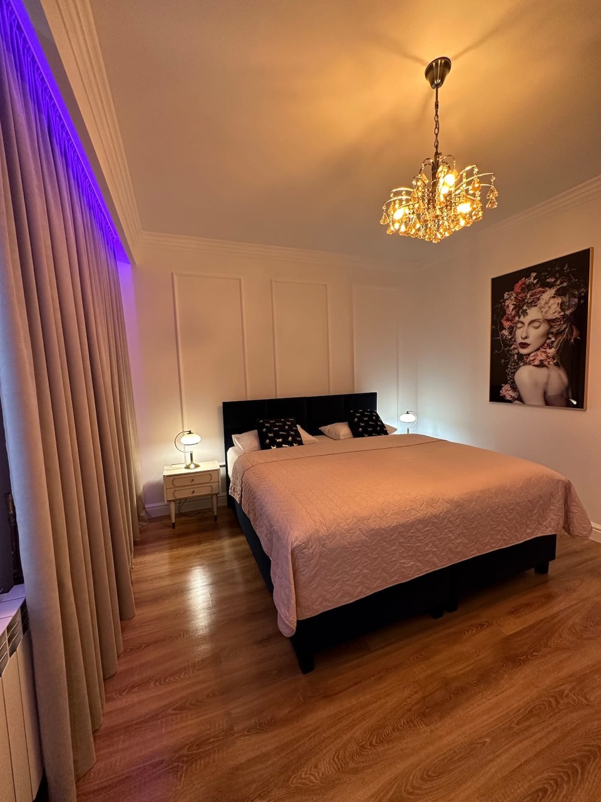{group="room3" fig-alt="Kącik do czytania — Apartament Nr 3" srcset="../images/opt/room3/12-corner-480.webp 480w, ../images/opt/room3/12-corner-960.webp 960w" sizes="(max-width: 768px) 50vw, 33vw" width="960" height="1280" loading="lazy" decoding="async"}

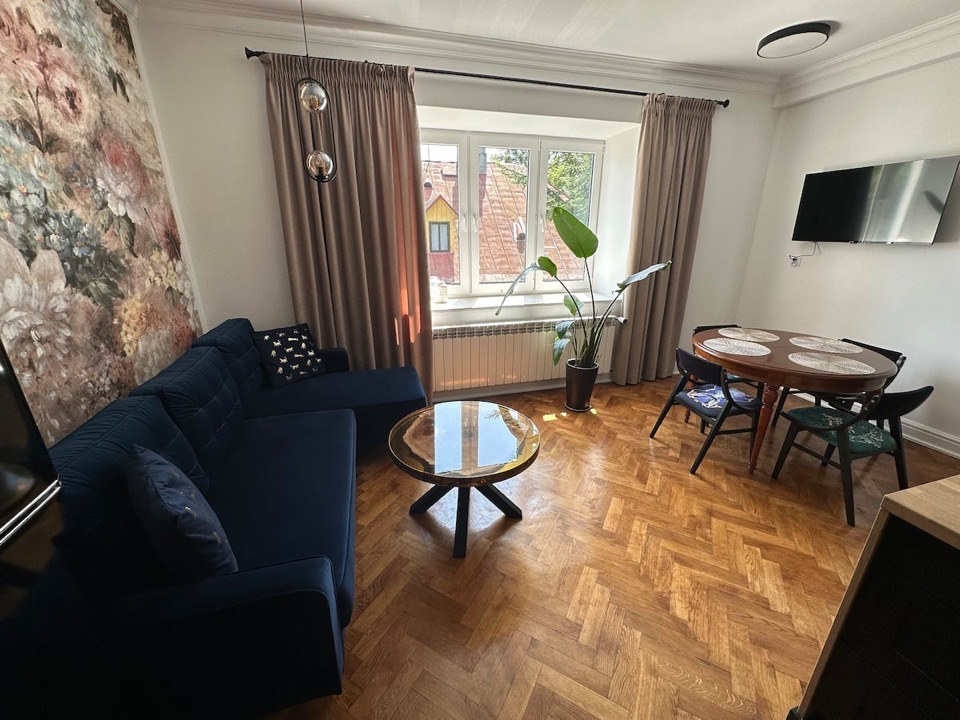{group="room3" fig-alt="Smart TV — Apartament Nr 3" srcset="../images/opt/room3/13-feature-480.webp 480w, ../images/opt/room3/13-feature-960.webp 960w" sizes="(max-width: 768px) 50vw, 33vw" width="960" height="720" loading="lazy" decoding="async"}

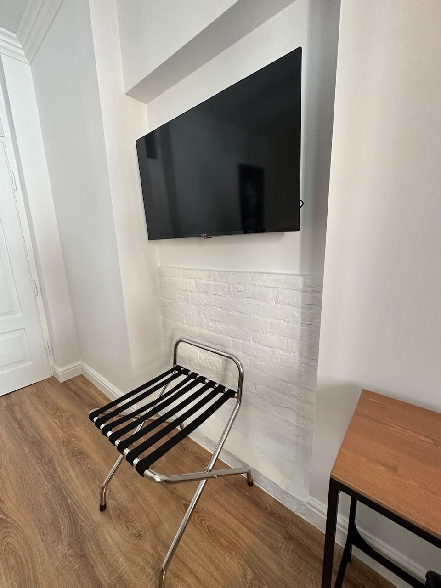{group="room3" fig-alt="Szafa i miejsce na rzeczy — Apartament Nr 3" srcset="../images/opt/room3/14-extra-480.webp 480w, ../images/opt/room3/14-extra-960.webp 960w" sizes="(max-width: 768px) 50vw, 33vw" width="960" height="1280" loading="lazy" decoding="async"}

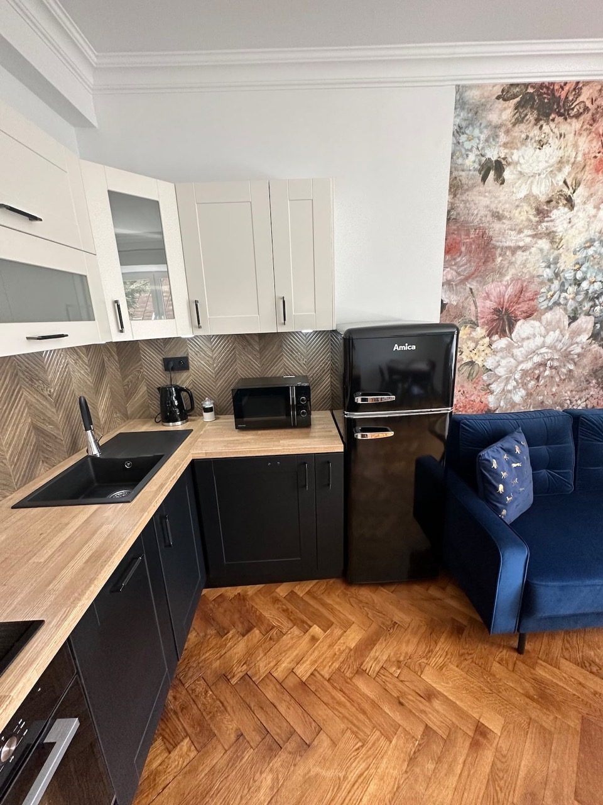{group="room3" fig-alt="Przedpokój — Apartament Nr 3" srcset="../images/opt/room3/15-final-480.webp 480w, ../images/opt/room3/15-final-960.webp 960w" sizes="(max-width: 768px) 50vw, 33vw" width="960" height="1280" loading="lazy" decoding="async"}

:::

::: {.section-cta}
[Zarezerwuj Apartament Nr 3](book-room3.qmd){.btn-gold}
:::

:::
:::

<!-- CTA -->
::: {.section .section-light}
::: {.container}
::: {.section-header}
[Obejrzane?]{.section-subtitle}

## Sprawdź terminy
:::

::: {.about-content}
Oba apartamenty są w jednym kalendarzu, więc od razu widać, co jest wolne w Twoim terminie.
:::

::: {.section-cta}
[Sprawdź dostępność](book.qmd){.btn-gold}
:::

:::
:::
